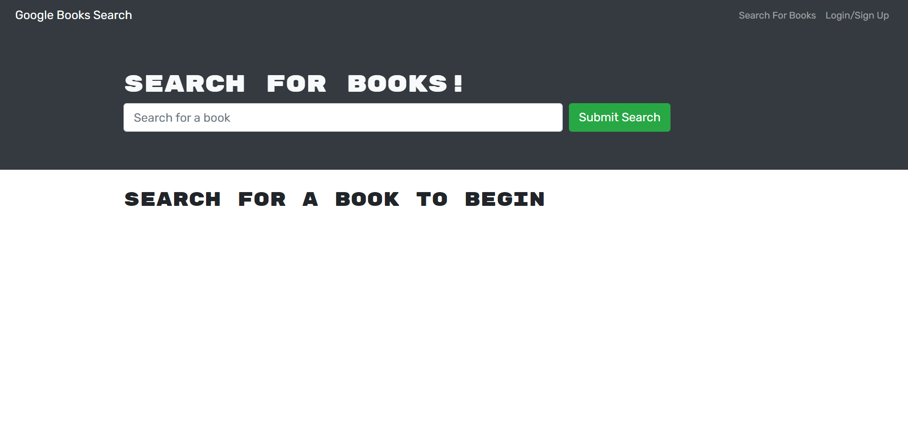

<h1 align="center">BOOK SEARCH ENGINE 👋</h1>

## Description

*Book Search Engine is an application that allows the users to search for their desired books using Googlr publicly available API. The application uses MERN stack and it is connected by Apollo Server and Apollo Provider node packages. In this application the user has the option to signup, login and search for the books and there has the option to save the books, retrieve the saved books and also delete the books. Without login to the application, the user also has the option to search for the book, but at that time he/she will not have the option to save the books. This is a very updated and timely software.*


## Table of Contents

- [Description](#description)
- [Table of Contents](#table-of-contents)
- [App Screenshots](#app-screenshots)
- [User Story](#user-story)
- [Installation](#installation)
- [Tools](#tools)
- [Usage](#usage)
- [Questions](#questions)


## App Screenshots
- Picture of the Application.


## User Story

```text
AS AN avid reader
I WANT to search for new books to read
SO THAT I can keep a list of books to purchase
```

## Installation
1.To use this app npm i
2.Npm dependencies must be installed to run the application properly: the needed dependencies will be found on the package.json file.
3.Create at cluster on Mongodb atlas. 

## Tools
- NodeJS
- MongoDB
- Mongoose
- Apollo
- React
- Graphql
- Google Book API

## Usage
💻   
  
Run the following command at the terminal:
  
`npm start`
[Deployed application](https://book-search-challenge-21-mern.herokuapp.com/)

## Questions
✉️ Contact me with any questions: [github](https://github.com/lretana1/BookSearch)